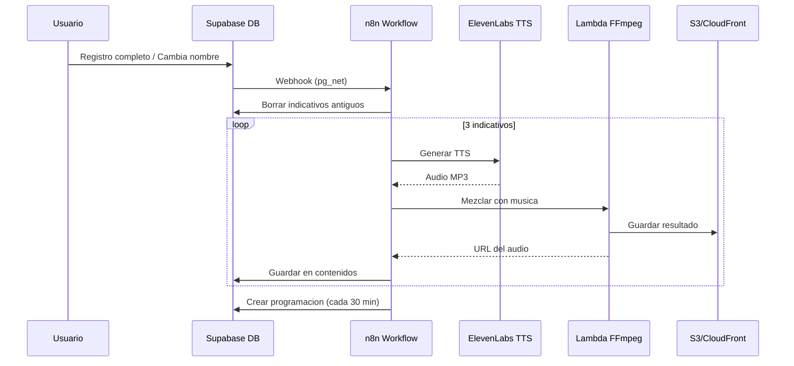

# Flujo Completo de Indicativos Automaticos

## Arquitectura del Sistema



## Pasos de Implementacion

### 1. Modificar Lambda para aceptar audio Base64

El workflow de n8n recibe el audio TTS de ElevenLabs como binario. La Lambda actual solo acepta URLs. Hay que modificarla para aceptar tambien `ttsBase64`.

**Archivo:** [lambda/ffmpeg-audio-mixer/index.mjs](lambda/ffmpeg-audio-mixer/index.mjs)

**Cambios:**

- Aceptar parametro `ttsBase64` como alternativa a `ttsUrl`
- Si viene base64, guardarlo en `/tmp` directamente
- Mantener compatibilidad con `ttsUrl`

### 2. Ejecutar Migraciones SQL en Supabase

**Archivo 1:** [database/add-ultimo-cambio-establecimiento.sql](database/add-ultimo-cambio-establecimiento.sql)

- Agrega columna `ultimo_cambio_establecimiento` a tabla `usuarios`
- Crea trigger que limita cambios de nombre a 1 vez por mes
- Crea funcion RPC `puede_cambiar_establecimiento()` para el frontend

**Archivo 2:** [database/indicativos-webhook-setup.sql](database/indicativos-webhook-setup.sql)

- Crea tabla `indicativos_generados` para tracking
- Habilita extension `pg_net`
- Crea funcion `notify_n8n_indicativos()` que envia webhook
- Crea triggers en tabla `usuarios`:
  - `trigger_indicativos_registro` (cuando `registro_completo = true`)
  - `trigger_indicativos_cambio_nombre` (cuando cambia `establecimiento`)

### 3. Configurar n8n

**Archivo workflow:** [n8n/indicativos-workflow.json](n8n/indicativos-workflow.json)

Pasos:

1. Importar el workflow JSON en n8n
2. Crear credencial **Postgres** con datos de Supabase
3. Crear credencial **Header Auth** para ElevenLabs (`xi-api-key`)
4. Configurar variable de entorno `LAMBDA_FFMPEG_URL`
5. Actualizar el nodo ElevenLabs TTS para enviar base64 a la Lambda
6. Activar workflow y copiar URL del webhook

### 4. Conectar Supabase con n8n

Configurar la URL del webhook en Supabase:

```sql
ALTER DATABASE postgres 
SET app.n8n_indicativos_webhook_url = 'https://tu-n8n.com/webhook/indicativos';
```

### 5. Probar el flujo completo

1. Test manual enviando POST al webhook de n8n
2. Verificar que se crean los 3 indicativos en S3
3. Verificar registros en tablas `contenidos`, `programaciones`, `indicativos_generados`
4. Test real: crear usuario de prueba y completar registro

## Credenciales Necesarias

- **API Key ElevenLabs** con permisos TTS (la actual no tiene permisos)
- **Conexion Postgres** de Supabase (host, user, password)
- **URL Lambda FFmpeg:** `https://chskbn3tnfgmcnntxmjmswz6740kjlrx.lambda-url.eu-north-1.on.aws/`

## Resultado Final

Cuando un gestor complete su registro:

- Se generan 3 indicativos:

  1. "Estas escuchando la radio de {establecimiento}"
  2. "{establecimiento}, Radio"
  3. "Bienvenido a {establecimiento}, radio"

- Cada uno dura 10 segundos con fade out
- Se programan para reproducirse cada 30 minutos
- Si cambia el nombre (max 1 vez/mes), se regeneran automaticamente