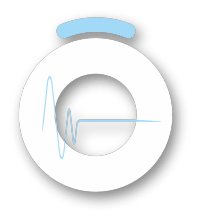

# Instrucciones para Implementar OndeonAppShowcase en TypeScript

Este documento contiene toda la información necesaria para implementar el componente `OndeonAppShowcase` en un proyecto TypeScript (.tsx).

## 📦 Dependencias Necesarias

El desarrollador debe instalar las siguientes dependencias:

```bash
npm install react react-dom framer-motion lucide-react
# o
yarn add react react-dom framer-motion lucide-react
```

### Versiones recomendadas:
- `react`: ^18.0.0
- `react-dom`: ^18.0.0
- `framer-motion`: ^10.0.0 o superior
- `lucide-react`: ^0.263.0 o superior

## 🎨 Estilos CSS Necesarios

El componente utiliza Tailwind CSS. Asegúrate de que tu proyecto tenga Tailwind configurado. Si no lo tienes, puedes usar estas clases CSS equivalentes o configurar Tailwind.

### Clase `.volume-slider` necesaria:

```css
.volume-slider {
  appearance: none;
  background: transparent;
  cursor: pointer;
  writing-mode: vertical-lr;
  direction: rtl;
}

.volume-slider::-webkit-slider-runnable-track {
  width: 3px;
  height: 100%;
  border-radius: 9999px;
  background: rgba(229, 231, 235, 0.2);
}

.volume-slider::-webkit-slider-thumb {
  appearance: none;
  width: 10px;
  height: 10px;
  border-radius: 50%;
  background: rgb(156, 163, 175);
  cursor: pointer;
  box-shadow: 0 0 10px rgba(128, 128, 128, 0.15);
  transition: all 0.3s;
  transform: translateX(-4px);
}

.volume-slider::-moz-range-track {
  width: 3px;
  height: 100%;
  border-radius: 9999px;
  background: rgba(229, 231, 235, 0.2);
}

.volume-slider::-moz-range-thumb {
  width: 10px;
  height: 10px;
  border-radius: 50%;
  background: rgb(156, 163, 175);
  cursor: pointer;
  border: none;
  box-shadow: 0 0 10px rgba(128, 128, 128, 0.15);
  transition: all 0.3s;
}
```

## 📁 Archivos a Proporcionar

### 1. Componente Principal: `OndeonAppShowcase.tsx`

```typescript
import React, { useState } from 'react';
import { motion } from 'framer-motion';
import { 
  ChevronLeft, 
  ChevronRight, 
  Play, 
  Pause, 
  Volume2, 
  Mic,
  Home as HomeIcon,
  Radio,
  BookOpen,
  History as HistoryIcon,
  MessageSquare,
  Circle
} from 'lucide-react';
import WaveBackground from './WaveBackground';

interface OndeonAppShowcaseProps {
  mode?: 'visual' | 'image' | 'iframe';
  imageSrc?: string;
  iframeSrc?: string;
}

interface NavItemProps {
  icon: React.ComponentType<{ className?: string }>;
  label: string;
  active?: boolean;
}

const OndeonAppShowcase: React.FC<OndeonAppShowcaseProps> = ({ 
  mode = 'visual',
  imageSrc = '/images/ondeon-app-screenshot.png',
  iframeSrc = 'https://ondeon.smart.app'
}) => {
  const [isPlaying, setIsPlaying] = useState<boolean>(false);
  const [currentChannel, setCurrentChannel] = useState<number>(0);
  const [musicVolume, setMusicVolume] = useState<number>(80);
  const [micVolume, setMicVolume] = useState<number>(100);

  const channels = [
    { name: 'Tiki Taka R&B', image: null },
    { name: 'Pop Hits', image: null },
    { name: 'Rock Classics', image: null },
  ];

  const currentSong = {
    title: 'Lost Obsidian Horizons',
    artist: 'Ondeón'
  };

  const handlePrevChannel = () => {
    setCurrentChannel((prev) => (prev === 0 ? channels.length - 1 : prev - 1));
  };

  const handleNextChannel = () => {
    setCurrentChannel((prev) => (prev === channels.length - 1 ? 0 : prev + 1));
  };

  const handlePlayPause = () => {
    setIsPlaying(!isPlaying);
  };

  // Modo imagen estática
  if (mode === 'image') {
    return (
      <div className="relative w-full max-w-md mx-auto">
        
      </div>
    );
  }

  // Modo iframe
  if (mode === 'iframe') {
    return (
      <div className="relative w-full max-w-md mx-auto aspect-[9/16] rounded-lg overflow-hidden shadow-2xl">
        <iframe
          src={iframeSrc}
          className="w-full h-full border-0"
          title="Ondeon Smart App"
          allow="autoplay; encrypted-media"
        />
      </div>
    );
  }

  // Modo visual (UI mockup) - RECOMENDADO
  return (
    <div className="ondeon-showcase relative w-full max-w-5xl mx-auto rounded-[32px] overflow-hidden dark">
      {/* Fondo animado idéntico al reproductor */}
      <WaveBackground isPlaying={isPlaying} />

      {/* Contenedor principal con el mismo fondo que la app */}
      <div className="relative bg-background min-h-[800px] px-12 py-10">
        {/* Header superior: logo + usuario */}
        <div className="flex items-center justify-between mb-10 max-w-7xl mx-auto">
          <div className="flex items-center gap-3">
             {
                (e.target as HTMLImageElement).style.display = 'none';
              }}
            />
            <span className="text-2xl tracking-[0.2em] font-light text-[#A2D9F7] font-sans">
              SMART
            </span>
          </div>

          {/* Panel usuario */}
          <div className="flex items-center gap-2 px-3 py-1.5 rounded-full bg-black/5 dark:bg-white/5 backdrop-blur-md border border-white/10 dark:border-white/10 shadow-[0_4px_20px_rgba(0,0,0,0.15)]">
            <span className="text-sm text-[#A2D9F7] flex items-center gap-2">
              TikiTakaAdministrador
              <Circle size={8} className="fill-green-500 text-green-500" />
            </span>
            <div className="w-8 h-8 rounded-full bg-black/5 dark:bg-white/5 flex items-center justify-center border border-white/10 dark:border-white/10">
              <span className="text-white/70 text-xs">☀</span>
            </div>
            <div className="w-8 h-8 rounded-full bg-black/5 dark:bg-white/5 flex items-center justify-center border border-white/10 dark:border-white/10">
              <span className="text-[#A2D9F7] text-xs">⚙</span>
            </div>
            <div className="w-8 h-8 rounded-full bg-black/5 dark:bg-white/5 flex items-center justify-center border border-white/10 dark:border-white/10">
              <span className="text-white/70 text-xs">→</span>
            </div>
          </div>
        </div>

        {/* Selector de canal centrado */}
        <div className="flex items-center justify-center gap-3 mb-4">
          <motion.button
            onClick={handlePrevChannel}
            whileHover={{ scale: 1.1 }}
            whileTap={{ scale: 0.95 }}
            className="w-10 h-10 rounded-full flex items-center justify-center bg-black/5 dark:bg-white/5 backdrop-blur-lg hover:bg-black/10 dark:hover:bg-white/10 transition-all duration-300 shadow-[0_0_15px_rgba(162,217,247,0.2)] dark:shadow-[0_0_15px_rgba(255,255,255,0.1)] hover:shadow-[0_0_20px_rgba(162,217,247,0.3)] dark:hover:shadow-[0_0_20px_rgba(255,255,255,0.2)]"
          >
            <ChevronLeft className="w-6 h-6 text-black/70 dark:text-white/70" />
          </motion.button>

          <motion.div 
            className="flex items-center gap-3 px-4 py-2 rounded-full bg-black/5 dark:bg-white/5 backdrop-blur-lg shadow-[0_0_20px_rgba(162,217,247,0.2)] dark:shadow-[0_0_20px_rgba(255,255,255,0.1)]"
            initial={{ opacity: 0, scale: 0.9 }}
            animate={{ opacity: 1, scale: 1 }}
            transition={{ duration: 0.3 }}
          >
            <div className="w-8 h-8 rounded-full bg-purple-500/30 flex items-center justify-center border border-purple-300/40 shadow-[0_0_18px_rgba(168,85,247,0.6)]">
              <Mic className="w-4 h-4 text-purple-100" />
            </div>
            <span className="text-sm font-sans font-light tracking-wider text-black/80 dark:text-white/80">
              {channels[currentChannel].name}
            </span>
          </motion.div>

          <motion.button
            onClick={handleNextChannel}
            whileHover={{ scale: 1.1 }}
            whileTap={{ scale: 0.95 }}
            className="w-10 h-10 rounded-full flex items-center justify-center bg-black/5 dark:bg-white/5 backdrop-blur-lg hover:bg-black/10 dark:hover:bg-white/10 transition-all duration-300 shadow-[0_0_15px_rgba(162,217,247,0.2)] dark:shadow-[0_0_15px_rgba(255,255,255,0.1)] hover:shadow-[0_0_20px_rgba(162,217,247,0.3)] dark:hover:shadow-[0_0_20px_rgba(255,255,255,0.2)]"
          >
            <ChevronRight className="w-6 h-6 text-black/70 dark:text-white/70" />
          </motion.button>
        </div>

        {/* Título de la canción */}
        <div className="text-center mb-4">
          <h2 className="text-2xl font-sans font-light tracking-wide text-black/90 dark:text-white/90">
            {currentSong.title}
          </h2>
          <p className="text-lg font-sans font-extralight tracking-wider text-black/70 dark:text-white/70">
            {currentSong.artist}
          </p>
        </div>

        {/* Zona central: sliders + botón play con círculos concéntricos */}
        <div className="relative min-h-[500px] flex items-center justify-center mb-12">
          {/* Volumen música (izquierda) */}
          <div className="absolute left-12 top-1/2 -translate-y-1/2 flex flex-col items-center gap-2 p-4 z-30">
            <div className="relative h-40 flex flex-col items-center">
              <div className="absolute -top-6 text-xs px-2 py-0.5 rounded-full bg-black/10 dark:bg-white/10 backdrop-blur-md text-white dark:text-white">
                {musicVolume}%
              </div>
              <input
                type="range"
                min="0"
                max="100"
                value={musicVolume}
                onChange={(e) => setMusicVolume(parseInt(e.target.value))}
                className="volume-slider"
                style={{ 
                  writingMode: 'vertical-lr',
                  direction: 'rtl',
                  width: '26px',
                  height: '160px'
                }}
              />
              <button className="mt-3 rounded-full p-2 bg-black/5 dark:bg-white/5 backdrop-blur-lg transition-all duration-300 shadow-[0_0_15px_rgba(128,128,128,0.15)] dark:shadow-[0_0_15px_rgba(128,128,128,0.1)] hover:bg-black/10 dark:hover:bg-white/10">
                <Volume2 className="w-5 h-5 text-gray-500 dark:text-gray-400" />
              </button>
            </div>
          </div>

          {/* Botón play central con círculos concéntricos */}
          <div className="relative z-20">
            {/* Círculos concéntricos alrededor del botón */}
            <div className="absolute top-1/2 left-1/2 -translate-x-1/2 -translate-y-1/2 pointer-events-none">
              <div className="absolute top-1/2 left-1/2 -translate-x-1/2 -translate-y-1/2 w-[420px] h-[420px] rounded-full border border-white/5 opacity-50" />
              <div className="absolute top-1/2 left-1/2 -translate-x-1/2 -translate-y-1/2 w-[320px] h-[320px] rounded-full border border-white/5 opacity-60" />
              <div className="absolute top-1/2 left-1/2 -translate-x-1/2 -translate-y-1/2 w-[240px] h-[240px] rounded-full border border-white/10 opacity-70" />
              <div className="absolute top-1/2 left-1/2 -translate-x-1/2 -translate-y-1/2 w-[170px] h-[170px] rounded-full border border-white/15 shadow-[0_0_25px_rgba(162,217,247,0.35)] opacity-80" />
            </div>

            {/* Botón play */}
            <motion.button
              onClick={handlePlayPause}
              whileHover={{ scale: 1.1 }}
              whileTap={{ scale: 0.95 }}
              transition={{ type: "spring", stiffness: 600, damping: 15 }}
              className="relative w-20 h-20 rounded-full flex items-center justify-center transition-all duration-150 z-10 bg-black/10 dark:bg-white/10 hover:bg-black/15 dark:hover:bg-white/15 backdrop-blur-lg shadow-[0_0_30px_rgba(162,217,247,0.3)] dark:shadow-[0_0_30px_rgba(255,255,255,0.2)] hover:shadow-[0_0_40px_rgba(162,217,247,0.4)] dark:hover:shadow-[0_0_40px_rgba(255,255,255,0.3)] text-black/90 dark:text-white/90"
            >
              {isPlaying ? (
                <Pause className="w-10 h-10" />
              ) : (
                <Play className="w-10 h-10 ml-1" />
              )}
            </motion.button>
          </div>

          {/* Volumen micro (derecha) */}
          <div className="absolute right-12 top-1/2 -translate-y-1/2 flex flex-col items-center gap-2 p-4 z-30">
            <div className="relative h-40 flex flex-col items-center">
              <div className="absolute -top-6 text-xs px-2 py-0.5 rounded-full bg-black/10 dark:bg-white/10 backdrop-blur-md text-white dark:text-white">
                {micVolume}%
              </div>
              <input
                type="range"
                min="0"
                max="100"
                value={micVolume}
                onChange={(e) => setMicVolume(parseInt(e.target.value))}
                className="volume-slider"
                style={{ 
                  writingMode: 'vertical-lr',
                  direction: 'rtl',
                  width: '26px',
                  height: '160px'
                }}
              />
              <button className="mt-3 rounded-full p-2 bg-black/5 dark:bg-white/5 backdrop-blur-lg transition-all duration-300 shadow-[0_0_15px_rgba(128,128,128,0.15)] dark:shadow-[0_0_15px_rgba(128,128,128,0.1)] hover:bg-black/10 dark:hover:bg-white/10">
                <Mic className="w-5 h-5 text-gray-500 dark:text-gray-400" />
              </button>
            </div>
          </div>
        </div>

        {/* Navegación inferior + versión */}
        <div className="mt-12">
          <div className="flex items-center justify-center gap-12 mb-3">
            <NavItem icon={HomeIcon} label="Reproductor" active />
            <NavItem icon={Radio} label="Canales" />
            <NavItem icon={BookOpen} label="Contenidos" />
            <NavItem icon={HistoryIcon} label="Historial" />
            <NavItem icon={MessageSquare} label="Soporte" />
          </div>
          <p className="text-center text-xs text-muted-foreground/70">
            Ondeon Smart v0.0.34
          </p>
        </div>
      </div>
    </div>
  );
};

// Componente auxiliar para items de navegación
const NavItem: React.FC<NavItemProps> = ({ icon: Icon, label, active = false }) => {
  return (
    <div className="flex flex-col items-center gap-1 cursor-pointer">
      <div className={`w-10 h-10 rounded-xl flex items-center justify-center transition-all ${
        active ? 'bg-white/10 text-white' : 'text-white/60 hover:text-white/80'
      }`}>
        <Icon className="w-5 h-5" />
      </div>
      <span className={`text-xs ${active ? 'text-white' : 'text-white/60'}`}>
        {label}
      </span>
    </div>
  );
};

export default OndeonAppShowcase;
```

### 2. Componente WaveBackground: `WaveBackground.tsx`

```typescript
import React from 'react';
import { motion } from 'framer-motion';

interface WaveBackgroundProps {
  isPlaying?: boolean;
}

const WaveBackground: React.FC<WaveBackgroundProps> = ({ isPlaying = true }) => {
  const mainColor = '#A2D9F7';
  const bgOpacity = 0.1;
  const particleOpacity = 0.3;

  return (
    <div className="absolute inset-0 overflow-hidden -z-10 bg-black">
      <div className="relative w-full h-full">
        {/* Ondas principales */}
        {[...Array(4)].map((_, i) => {
          const randomX = 50 + Math.sin(i) * 10;
          const randomY = 50 + Math.cos(i) * 10;
          return (
            <motion.div
              key={i}
              className="absolute inset-0"
              initial={{ opacity: 0.3, scale: 1 }}
              animate={{
                opacity: [0.2, 0.4, 0.2],
                scale: [1, 1.2, 1],
                rotate: [0, 180, 360],
              }}
              transition={{
                duration: isPlaying ? 8 : 20,
                delay: i * 0.5,
                repeat: Infinity,
                ease: "linear"
              }}
            >
              <div 
                className="absolute w-full h-full"
                style={{
                  backgroundColor: mainColor,
                  opacity: isPlaying ? bgOpacity : bgOpacity * 0.5,
                  clipPath: `circle(${50 + i * 8}% at ${randomX}% ${randomY}%)`,
                  filter: 'blur(16px)',
                  mixBlendMode: 'plus-lighter',
                  willChange: 'transform, opacity'
                }}
              />
            </motion.div>
          );
        })}
        {/* Partículas */}
        {[...Array(10)].map((_, i) => {
          const randomWidth = Math.random() * 2 + 1;
          const randomHeight = Math.random() * 2 + 1;
          const randomX1 = Math.random() * 100;
          const randomY1 = Math.random() * 100;
          const randomX2 = Math.random() * 100;
          const randomY2 = Math.random() * 100;
          const randomX3 = Math.random() * 100;
          const randomY3 = Math.random() * 100;
          const randomX4 = Math.random() * 100;
          const randomY4 = Math.random() * 100;
          const duration = 10 + Math.random() * 6;
          const delay = -Math.random() * 6;
          
          return (
            <motion.div
              key={`particle-${i}`}
              className="absolute rounded-full"
              style={{
                width: `${randomWidth}px`,
                height: `${randomHeight}px`,
                backgroundColor: mainColor,
                opacity: isPlaying ? particleOpacity : particleOpacity * 0.5,
                filter: 'blur(0.5px)',
                willChange: 'transform, opacity'
              }}
              initial={{ 
                x: `${randomX1}%`,
                y: `${randomY1}%`,
                scale: 0
              }}
              animate={{
                x: [`${randomX1}%`, `${randomX2}%`, `${randomX3}%`, `${randomX4}%`],
                y: [`${randomY1}%`, `${randomY2}%`, `${randomY3}%`, `${randomY4}%`],
                scale: [0, 1.2, 1, 0],
                opacity: [0, particleOpacity, particleOpacity, 0]
              }}
              transition={{
                duration: duration,
                repeat: Infinity,
                ease: "linear",
                delay: delay
              }}
            />
          );
        })}
        {/* Capa adicional de brillo */}
        <div 
          className="absolute inset-0 bg-gradient-to-b"
          style={{
            backgroundImage: `linear-gradient(to bottom, rgba(162, 217, 247, 0.04), transparent)`,
            mixBlendMode: 'plus-lighter',
            filter: 'blur(20px)',
          }}
        />
      </div>
    </div>
  );
};

export default WaveBackground;
```

## 🖼️ Assets Necesarios

El componente necesita la siguiente imagen en la carpeta `public/assets/`:

- `icono-ondeon.png` - Logo de Ondeón (recomendado: 256x256px o superior)

## 📝 Ejemplo de Uso

### Uso Básico (Modo Visual - Recomendado):

```tsx
import OndeonAppShowcase from './components/OndeonAppShowcase';

function HeroSection() {
  return (
    <section className="min-h-screen flex items-center justify-center bg-gradient-to-b from-gray-900 to-gray-800 px-4">
      <div className="container mx-auto grid md:grid-cols-2 gap-12 items-center">
        {/* Contenido de texto */}
        <div className="text-white">
          <h1 className="text-5xl font-bold mb-4">
            La mejor radio sin SGAE para{' '}
            <span className="text-[#A2D9F7]">Hostelería</span>
          </h1>
          <p className="text-xl mb-2">100% legales para uso público.</p>
          <p className="text-xl mb-8">
            10 veces más económico. Empieza en 5 minutos.
          </p>
          <button className="bg-white text-gray-900 px-8 py-3 rounded-lg font-semibold hover:bg-gray-100 transition-colors">
            PROBAR GRATIS
          </button>
        </div>

        {/* Showcase del reproductor */}
        <div className="flex justify-center">
          <OndeonAppShowcase mode="visual" />
        </div>
      </div>
    </section>
  );
}
```

### Otros Modos:

```tsx
// Modo imagen estática
<OndeonAppShowcase 
  mode="image" 
  imageSrc="/images/ondeon-app-screenshot.png" 
/>

// Modo iframe (requiere login)
<OndeonAppShowcase 
  mode="iframe" 
  iframeSrc="https://ondeon.smart.app" 
/>
```

## ⚙️ Configuración de Tailwind CSS

Si tu proyecto usa Tailwind CSS, asegúrate de tener configurado el modo oscuro. En tu `tailwind.config.js`:

```javascript
module.exports = {
  darkMode: 'class', // o 'media'
  // ... resto de configuración
}
```

Y asegúrate de que las clases de color personalizadas (`bg-background`, `text-muted-foreground`, etc.) estén definidas en tu configuración de Tailwind o reemplázalas con colores específicos.

## 🎨 Personalización de Colores

Si no tienes las variables CSS personalizadas (`bg-background`, `text-muted-foreground`), puedes reemplazarlas:

- `bg-background` → `bg-gray-900` o `bg-black`
- `text-muted-foreground/70` → `text-gray-400`
- `dark:bg-white/5` → `bg-white/5` (si no usas modo oscuro)

## 📋 Checklist para el Desarrollador

- [ ] Instalar dependencias: `react`, `react-dom`, `framer-motion`, `lucide-react`
- [ ] Crear componente `OndeonAppShowcase.tsx`
- [ ] Crear componente `WaveBackground.tsx`
- [ ] Agregar estilos CSS para `.volume-slider`
- [ ] Agregar imagen `icono-ondeon.png` en `public/assets/`
- [ ] Configurar Tailwind CSS (si aplica)
- [ ] Importar y usar el componente en la sección hero

## 🔧 Notas Importantes

1. **Modo Visual es el recomendado**: Ofrece la mejor experiencia sin requerir autenticación
2. **Responsive**: El componente se adapta automáticamente a diferentes tamaños de pantalla
3. **Interactivo**: Todos los controles funcionan (volumen, play/pause, cambio de canal)
4. **Sin dependencias externas**: No requiere conexión a APIs ni autenticación

## 📞 Soporte

Si tienes dudas sobre la implementación, contacta al equipo de desarrollo de Ondeon Smart.

